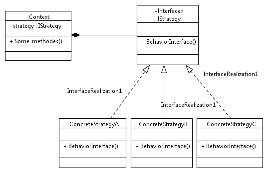

Design pattern strategy
#######################

.. warning:: Principe de conception Identifiez les aspects de votre application qui varient et séparez-les de ceux qui demeurent constants

.. warning:: Principe de conception Programmer une interface non une implémentation 

La relation **A-UN**: Lorsque vous assemblez deux classes vous utilisez la composition. 
Au lieu d'hériter leur comportement, les objets l'obtiennent en étant composés avec le bon objet comportemental

.. warning:: Principe de conception Préférez la composition à l'héritage.

**Le pattern Stratégie** définit une famille d'algorithmes, encapsule chacun d'eux et  les rend interchangeables. 
Stratégie permet à l'algorithme de varier indépendamment des clients qui l'utilisent.

**Base de l'OO** ::
 Abstraction
 Encapsulation
 Polymorphisme
 Héritage

**Principe OO** ::

 Encapsulez ce qui varient
 Préférerez la composition à l'héritage
 Programmez des interfaces non des implémentations
 Efforcez-vous de coupler faiblement les objets qui interagissent

**Principe de conception** ::
 
 Efforcez-vous de coupler faiblement les objets qui interagissent.
 Les classes doivent être ouvertes à l'extension mais fermées à la modification.

 https://github.com/bethrobson/Head-First-Design-Patterns/tree/master/src/headfirst/designpatterns/strategy
 

see :ref:`strategy_Java`

see :ref:`strategy_PHP`

