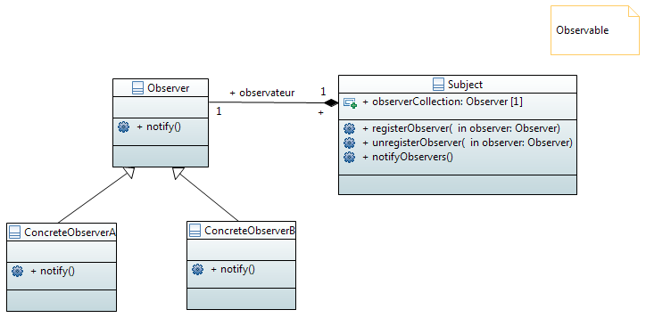

Design pattern observer
#######################

Le **pattern observateur** définit une relation entre objets de type un-à-plusieurs, 
de façon que, lorsque un objet change d'état, tous ceux qui en dépendent 
en soient notifiés et soient mis à jour automatiquement.

**Principe de conception**: Efforcez-vous de coupler faiblement les objets qui interagissent.

lien vers le code source

https://github.com/bethrobson/Head-First-Design-Patterns/tree/master/src/headfirst/designpatterns/observer

see :ref:`observer_Java`