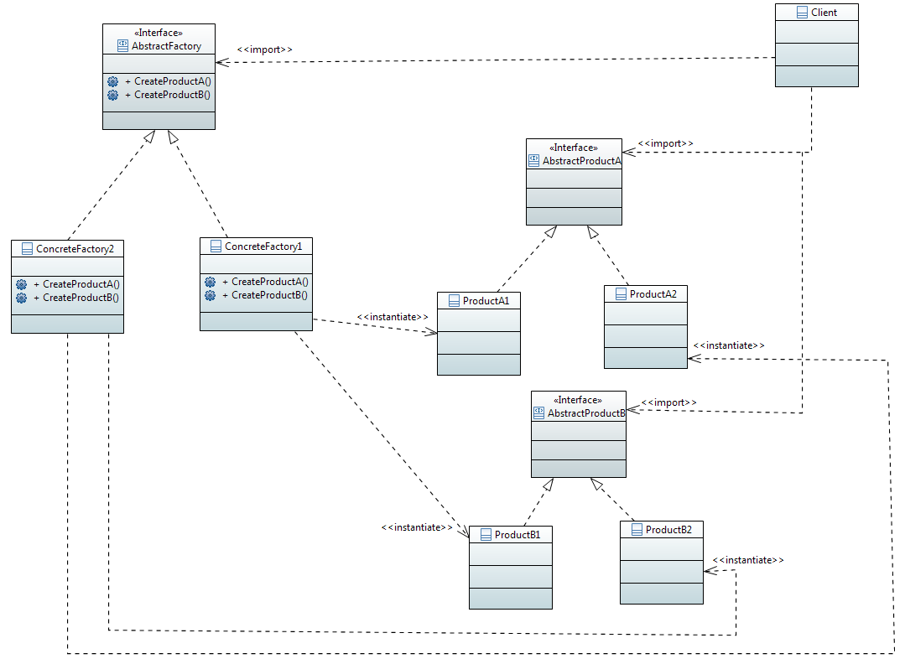

###############################
Design pattern Abstract Factory
###############################

https://github.com/bethrobson/Head-First-Design-Patterns/tree/master/src/headfirst/designpatterns/factory

interface FabriqueIngredientsPizza::

 Public interface FabriqueIngredientsPizza {
    public Pate creerPate();
    public Sauce creerSauce();
    public Fromage creerFromage();
    public Legume[] creerLegumes();
    public Poivrons creerPoivrons();
    public Moules creerMoules();
 }
   

class FabriqueIngredientsPizzaBrest::

 public class FabriqueIngredientsPizzaBrest implements FabriqueIngredientsPizza {
   public Pate creerPate() {
      return new PateFine();
   }
   
   public Sauce creerSauce() {
      return new SauceMarinara();
   }
   
   public Fromage creerFromage() {
      return new Reggiano();
   }
   
   public Legume[] creerLegumes() {
      Legume legume[] = {new ail(), new oignon(), new champignon()};
      return legume;
   }
   
   public Moules creerMoules() {
      return new MoulesFraiches();
   }
 }
 
class Pizza::

 public abstract class Pizza {
   String nom;
   Pate  pate;
   Sauce sauce;
   Legume legume[];
   Fromage fromage;
   Moules   moules;
   
   abstrac void preparer();
   
   void cuire () {}
   void couper() {}
   void emballer() {}
 }
 

class PizzaFromage::

 public class PizzaFromage extends Pizza {
   FabriqueIngredientsPizza fabriqueIngredients;
   
   public PizzaFromage(FabriqueIngredientsPizza fabriqueIngredients) {
      this.fabriqueIngredients = fabriqueIngredients;
   }

   void preparer() {
      pate = fabriqueIngredients.creerPate();
      sauce = fabriqueIngredients.creerSauce();
      fromage = fabriqueIngredients.creerFromage();
   }
 }
 
class PizzeriaBrest:: 

 public class PizzeriaBrest extends Pizzeria {
   protected pizza creerPizza(String item) {
      Pizza pizza = null;
      FabriqueIngredientPizza fabriqueIngredients = new FabriqueIngredientPizzaBrest();
      if (choix.equals("fromage")) {
         pizza = new PizzaFromage(fabriqueIngredients);
      }
      else if (choix.equals("vegetarienne")) {
         pizza = new PizzaVegetarienne(fabriqueIngredients);
      } 
      
      return pizza;
 }