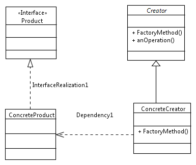
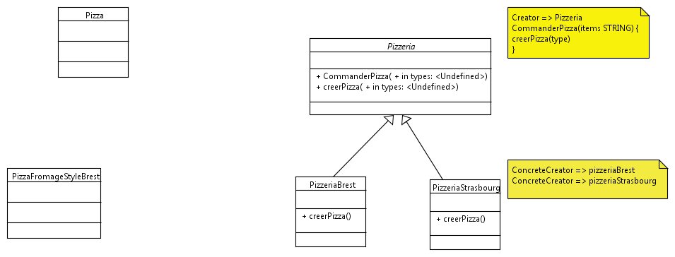

#############################
Design Pattern Factory Method
#############################

Class creator ::

 public abstract class creator {
   protected abstract Product factoryMethod();
   public void anOperation()
   {
      Product product = factoryMethod();
   }
   
  
 }

 public class ConcreteCreator extends Creator 
 {
   protected Product factoryMethod() 
   {
      return new ConcreteProduct();
   }
 }
 
 public interface Product { }
 
 public class ConcreteProduct implements Product { }
 
 public class Client 
 {
   public static void main( String arg[] ) 
   {
      Creator creator = new ConcreteCreator();
      creator.anOperation();
   }
 }
 
 
 
 

Class pizzeria ::

 public abstract class pizzeria {
      
   public Pizza commanderPizza(string type) {
      Pizza pizza;   
      pizza = creerPizza(type);
      pizza.preparer();
      pizza.cuire();
      pizza.couper();
      pizza.emballer 
      
      return pizza;
   }
   
   protected abstract Pizza creerPizza(string type);
   
 }
 
 public class PizzeriaBrest extends Pizzeria {
   Pizza creerPizza(String item) {
      if (choix.equals("fromage")) {
         return new PizzaFromageStyleBrest();
      }
      else if (choix.equals("vegetarienne")) {
         return new PizzaVegetarienneStyleBrest();
      }
      else if (choix.equals("fruitDeMer")) {
         return new PizzaFruitDeMerStyleBrest();
      } 
      else return null;
    }
  }
  
  Public abstract class Pizza {
     String nom;
     String pate;
     String sauce;
     ArrayList garniture = new ArraList();
     
     void preparer() {
        System.out.println("Préparation de " + nom);
        System.out.println("etalage de la pate  ");
        for (int i = 0; i < garniture.size(); i++) {
            System.out.printl("" + garniture.get(i));
        }
     }     
     void cuire () {}
     void couper() {}
     void emballer() {}
    }
    
    Public class PizzaFromageStyleBrest extend Pizza {
      public PizzaFromageStyleBrest() {
         nom = "Pizza sauce style brest et fromage ";
         garniture.add("..."); 
      }
    }
    
    
    public class pizzaTestDrive {
      public static void main(String[] args) {
         Pizzeria boutiqueBrest = new PizzeriaBrest();
                  
         Pizza pizza = boutiqueBrest.commanderPizza("fromage");
      }
    }
         
    
     
 
 
 
   