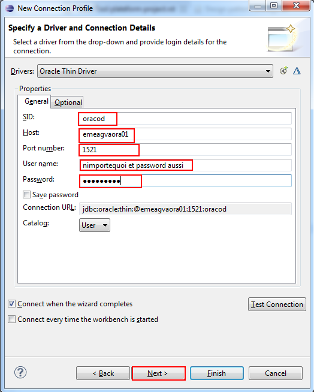

###########################
Data Tool Plateform project
###########################

Installation
Help -> install new software

Open perspective
Window->Open Perspective->other

Open Explorer
Window->Show view->other

Création d'une connexion
 

à la base Oracle

Configuration de la connexion à la base Oracle

Selection du driver JDBC

Suppression du Driver proposé pour mettre le notre

ATTENTION: Bidouille pour le User et le password. Dans l'écran de configuration ci-dessous il est obligatoire bien
que dans la configuration Oracle d'APSYS il ne soit pas utile. On va donc saisir n'importe quoi comme
user et password pour pouvoir valider l'écran. On reviendra ensuite sur cette écran de configuration 
pour les retirer et la ça passe.

On obtient finalement notre connexion à la base Oracle on double clique sur l'icone oracle dans l'explorer
On a un fenetre intermédiaire de connexion avec une alerte sur le user on l'igore et on valide la fenêtre avec
le bouton ok

Et on obtient notre connexion à la base Oracle

