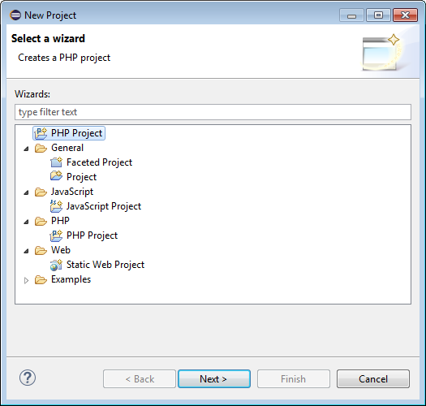
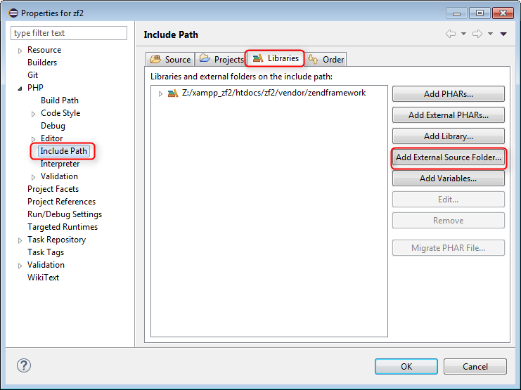

Nouveau projet git dans eclipse
###############################

Pour utiliser git dans eclipse deux possibilites. Soit on initialise le projet git à partir d'un projet deja existant dans Eclipse.
Bouton droit sur le projet que l'on souhaite initialiser avec git puis l'option Team et puis l'option share project.

Une fenetre d'option s'ouvre pour proposer les differents CVS disponibles si Egit est installe alors on pourra le partager avec git.

Sinon cloner un projet existant depuis un repository git.
Pour cela faire File->import

J'utilise l'option Projects from git.

On remplit maintenant le detail du protocol selectionné pour cloner le dépot distant.
Dans le cas ci-dessous j'utilise ssh (à confirmer que toutes les valeurs saisie fonctionnent notament l'URI).
Le user/password il me semble n'est pas utile lorsque je suis configuré avec connection avec un fichier comme clé.

 
Exemple pour github en https

Puis on configure le repertoire dans lequel on va cloner le projet et en même temps initialiser le repository sur notre machine.

A cette étape on choisit le repertoire ou l'on souhaite cloner le repository distant.
Automatiquement le repertoire zf2 va être créer. je choisie simplement le repertoire ou je souhaite créer le repertoire zf2.
 

Puis on va créer le projet Eclipse par exemple pour nous un projet PHP dans lequel on importera plus tard la librairie ZendFramework.

Ici mon repertoire de travail existe déjà Z:\\xampp_zf2\\htdocs\\zf2 il a été créé au moment du clone du projet. 
je peux donc choisir de copier les librairies maintenant ou plus tard si je décide de les télécharger via composer.

Ici pour l'exemple je les copie immédiatement

Puis j'indique simplement le repertoire ou se situe cette librairie à l'aide du bouton add external source folder

Et voilà projet créé depuis un repository git

Si l'on souhaite rajouter une librairie par la suite.
Bouton droit de la souris sur le projet puis properties

Puis includ_path dans les options de PHP et finalement onglet library.

Validation des modifications
****************************

