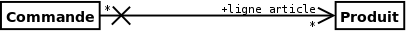

UML
===
Source
http://laurent-audibert.developpez.com/Cours-UML/?page=diagramme-classes

Caractéristiques d'une classe
-----------------------------

Une **classe** définit un jeu d'objets dotés de caractéristiques communes. Les caractéristiques d'un objet permettent de spécifier son état et son comportement.

**état d'un objet** : Ce sont les attributs et généralement les terminaisons d'associations, tous deux réunis sous le terme de propriétés structurelles, 
ou tout simplement propriétés2, qui décrivent l'état d'un objet

**Comportement d’un objet** : Les opérations décrivent les éléments individuels d’un comportement que l’on peut invoquer. 
Ce sont des fonctions qui peuvent prendre des valeurs en entrée et modifier les attributs ou produire des résultats

|          _____________________
|          NOM_DE_LA_CLASSE     
|          _____________________
|          -attribut_1: type1   
|          -attribut_2: type2   
|          _____________________
|          +operation_1():type1 
|          +operation_2():void  
|          _____________________
|      
|        représentation UML d'une classe

          
Les attributs
-------------
**Attributs de la classe**
Les attributs définissent des informations qu’une classe ou un objet doivent connaître. Ils représentent les données encapsulées dans les objets de cette classe. 
Chacune de ces informations est définie par un nom, un type de données, une visibilité et peut être initialisé

          
L'**encapsulation** est un mécanisme consistant à rassembler les données et les méthodes au sein d'une structure en cachant l'implémentation de l'objet, 
c'est-à-dire en empéchant l'accés aux données par un autre moyen que les services proposés. Ces services accessibles (offerts) aux utilisateurs de l'objet 
définissent ce que l'on appel l'interface de l'objet (sa vue externe). L'encapsulation permet donc de garantir l'intégrité des données contenues dans l'objet.

| **Public** ou + : tout élément qui peut voir le conteneur peut également voir l'élément indiqué. 
| **Protected** ou # : seul un élément situé dans le conteneur ou un de ses descendants peut voir l'élément indiqué. 
| **Private** ou - : seul un élément situé dans le conteneur peut voir l'élément. 
| **Package** ou ~ ou rien : seul un élément déclaré dans le même paquetage peut voir l'élément.

**Méta-langage des syntaxes**

| [ ] : les crochets indiquent que ce qui est à l’intérieur est optionnel ; 
| < > : les signes inférieur et supérieur indiquent que ce qui est à l’intérieur est plus ou moins libre ; par exemple, la syntaxe de déclaration d’une variable comme compteur : int est <nom_variable> : <type> ; 
| ’ ’ : les cotes sont utiles quand on veut utiliser un méta-caractère comme un caractère ; par exemple, pour désigner un crochet ([) il faut écrire ’[’ car [ est un méta-caractère ayant une signification spéciale ; 
| ... : permet de désigner une suite de séquence de longueur non définie, le contexte permettant de comprendre de quelle suite il s’agit.

Les méthodes
------------

**Méthode de classe**
Comme pour les attributs de classe, il est possible de déclarer des méthodes de classe. Une méthode de classe ne peut manipuler que des attributs de classe et ses propres paramètres. Cette méthode n’a pas accès aux attributs de la classe (i.e. des instances de la classe). L’accès à une méthode de classe ne nécessite pas l’existence d’une instance de cette classe.
Graphiquement, une méthode de classe est soulignée.

**Méthodes et classes abstraites**
Une méthode est dite abstraite lorsqu’on connaît son entête mais pas la manière dont elle peut être réalisée (i.e. on connaît sa déclaration mais pas sa définition).
Une classe est dite abstraite lorsqu’elle définit au moins une méthode abstraite ou lorsqu’une classe parent contient une méthode abstraite non encore réalisée.
On ne peut instancier une classe abstraite : elle est vouée à se spécialiser. Une classe abstraite peut très bien contenir des méthodes concrètes.
Une classe abstraite pure ne comporte que des méthodes abstraites. En programmation orientée objet, une telle classe est appelée une interface.
Pour indiquer qu’une classe est abstraite, il faut ajouter le mot-clef abstract derrière son nom.

**Classe active**
Une classe est passive par défaut, elle sauvegarde les données et offre des services aux autres. Une classe active initie et contrôle le flux d’activités.

Graphiquement, une classe active est représentée comme une classe standard dont les lignes verticales du cadre, sur les côtés droit et gauche, sont doublées.

Relation entre classe
---------------------
**Notion d'association**

Une association est une relation entre deux classes (association binaire) ou plus (association n-aire), qui décrit les connexions structurelles entre leurs instances. 
Une association indique donc qu’il peut y avoir des liens entre des instances des classes associées.

.. image:: images/concept_association.png

Terminaison d’association
-------------------------

**Propriétaire d’une terminaison d’association**
La possession d’une terminaison d’association par le classeur situé à l’autre extrémité de l’association peut être spécifié graphiquement par l’adjonction d’un petit cercle plein (point) 
entre la terminaison d’association et la classe. Il n’est pas indispensable de préciser la possession des terminaisons d’associations. Dans ce cas, la possession est ambiguë. 
Par contre, si l’on indique des possessions de terminaisons d’associations, toutes les terminaisons d’associations sont non ambiguë : la présence d’un point implique que la terminaison d’association 
appartient à la classe située à l’autre extrémité, l’absence du point implique que la terminaison d’association appartient à l’association.

**Une terminaison d’association est une propriété**

Une propriété peut être paramétrée par les éléments suivant:
 **nom** : Comme un attribut, une terminaison d’association peut être nommée. Le nom est situé à proximité de la terminaison, mais contrairement à un attribut, ce nom est facultatif. 
 Le nom d’une terminaison d’association est appelée nom du rôle. Une association peut donc posséder autant de noms de rôle que de terminaisons (deux pour une association binaire et n pour une association n-aire). 
 
 **visibilité** : Comme un attribut, une terminaison d’association possède une visibilité. 
 La visibilité est mentionnée à proximité de la terminaison, et plus précisément, le cas échéant, devant le nom de la terminaison. 
 
 **multiplicité**: Comme un attribut, une terminaison d’association peut posséder une multiplicité. 
 Elle est mentionnée à proximité de la terminaison. Il n’est pas impératif de la préciser, mais, contrairement à un attribut dont la multiplicité par défaut est 1, la multiplicité par défaut d’une terminaison 
 d’association est non spécifiée. L’interprétation de la multiplicité pour une terminaison d’association est moins évidente que pour un attributs. 
 
 **navigabilité** : Pour un attribut, la navigabilité est implicite, navigable, et toujours depuis la classe vers l’attribut. Pour une terminaison d’association, la navigabilité peut être précisée
 
 **Association binaire et n-aire**
 **Association binaire**
 

   
   
**Association n-aire**

La ligne pointillé d’une classe-association peut être reliée au losange par une ligne discontinue pour représenter une association n-aire dotée d’attributs, d’opérations ou d’associations

**Remarque** :

 Il faut noter que, pour les habitués du modèle entité/relation, les multiplicités sont en UML « à l’envers » (par référence à Merise) pour les associations binaires et « à l’endroit » pour les n-aires avec n>2.
 
 
 **Navigabilité**
 

La navigabilité indique s’il est possible de traverser une association. On représente graphiquement la navigabilité par une flèche du côté de la terminaison navigable et on empêche la navigabilité par une croix du côté de la terminaison non navigable
la terminaison du côté de la classe Commande n’est pas navigable : cela signifie que les instances de la classe Produit ne stockent pas de liste d’objets du type Commande. Inversement, la terminaison du côté de la classe Produit est navigable : chaque objet commande contient une liste de produits. 

Agrégation et Composition
-------------------------

**Agrégation**
  
Une association simple entre deux classes représente une relation structurelle entre pairs, c’est à dire entre deux classes de même niveau conceptuel : aucune des deux n’est plus importante que l’autre. 
Lorsque l’on souhaite modéliser une relation tout/partie où une classe constitue un élément plus grand (tout) composé d’éléments plus petit (partie), il faut utiliser une agrégation.
Graphiquement, on ajoute un losange vide du côté de l’agrégat.

**Composition**
  La composition, également appelée agrégation composite, décrit une contenance structurelle entre instances. Ainsi, la destruction de l’objet composite implique la destruction de ses composants. 
  Une instance de la partie appartient toujours à au plus une instance de l’élément composite : la multiplicité du côté composite ne doit pas être supérieure à 1 (i.e. 1 ou 0..1). 
  Graphiquement, on ajoute un losange plein (✦) du côté de l’agrégat.
  
  
Généralisation et Héritage
--------------------------

La généralisation décrit une relation entre une classe générale (classe de base ou classe parent) et une classe spécialisée (sous-classe). 
La classe spécialisée est intégralement cohérente avec la classe de base, mais comporte des informations supplémentaires (attributs, opérations, 
associations). Un objet de la classe spécialisée peut être utilisé partout où un objet de la classe de base est autorisé. 

Dans le langage UML, ainsi que dans la plupart des langages objet, cette relation de généralisation se traduit par le concept d’héritage.

Dépendance
----------

Une dépendance est une relation unidirectionnelle exprimant une dépendance sémantique entre des éléments du modèle. 
Elle est représentée par un trait discontinu orienté. Elle indique que la modification de la cible peut impliquer une modification de la source. 
La dépendance est souvent stéréotypée pour mieux expliciter le lien sémantique entre les éléments du modèle.

On utilise souvent une dépendance quand une classe en utilise une autre comme argument dans la signature d’une opération. 
Par exemple, le diagramme montre que la classe Confrontation utilise la classe Stratégie car la classe Confrontation possède une méthode confronter 
dont deux paramètre sont du type Stratégie. Si la classe Stratégie, notamment son interface, change, alors des modifications devront également être 
apportées à la classe Confrontation.
   